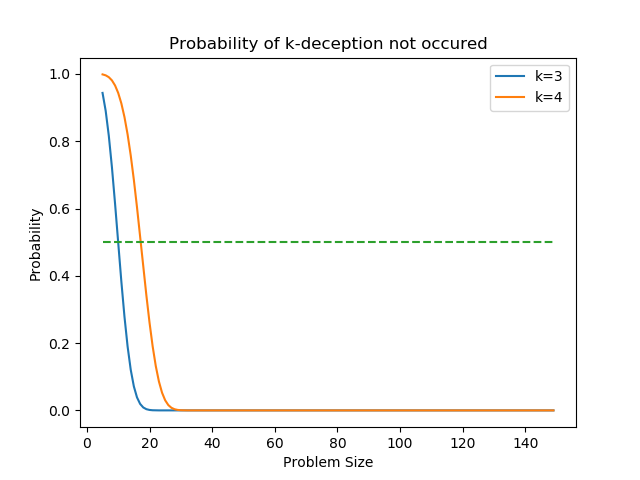
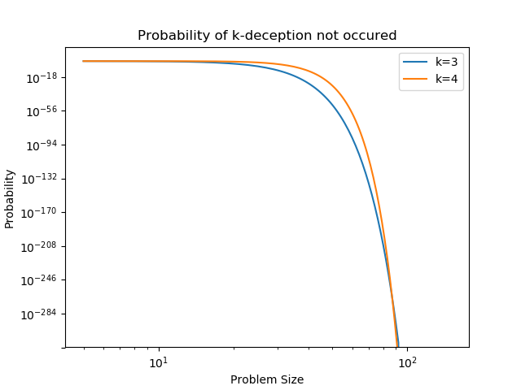
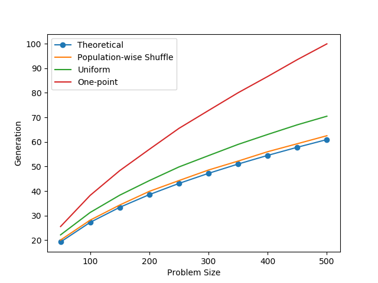
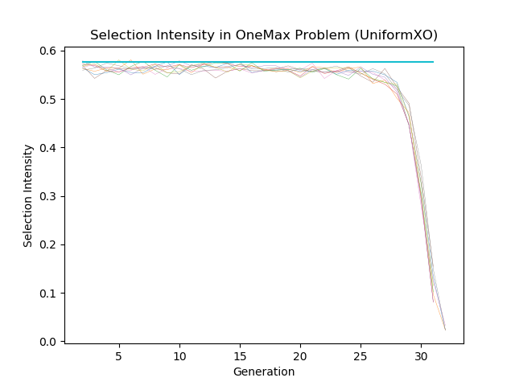
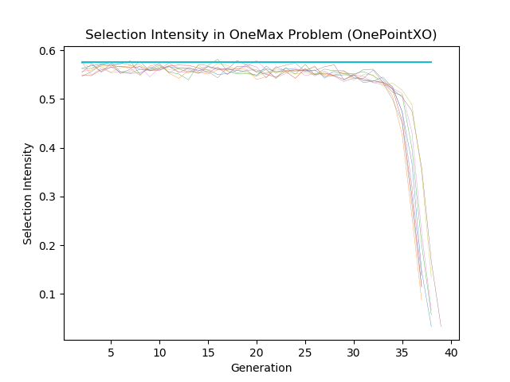
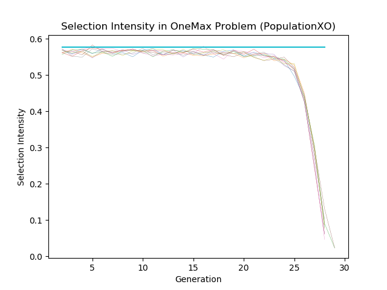

# Genetic Algorithm HW1

## Problem 1 Deception In a Random Function

Question:
> Let’s check how often deception occurs in a random function.

> A. Consider the case with two genes. By assigning fitness values for f(00), f(01), f(10), and f(11), does deception ever occur? Prove it cannot happen if not, give an example if yes.

We will find that **2-deception doesn't exists**.

First assume $f(11)$ is the highest value, by the definition of deception, we can write

$$
    \begin{array}{lr}
        f(0*) > f(1*) & \\
        f(*0) > f(*1) & \\
    \end{array}
$$

Where

$$
    \begin{array}{lr}
        f(0*) = \frac{1}{2} (f(00) + f(01)) & \\
        f(1*) = \frac{1}{2} (f(10) + f(11)) & \\
        f(*0) = \frac{1}{2} (f(00) + f(10)) & \\
        f(*1) = \frac{1}{2} (f(01) + f(11)) 
    \end{array}
$$

By the inequality 
$$
    f(0*) - f(*1) > f(1*) - f(*0)
$$

$$
    \frac{1}{2} (f(00) + f(01)) - \frac{1}{2} (f(01) + f(11)) > \frac{1}{2} (f(10) + f(11)) - \frac{1}{2} (f(00) + f(10))
$$

$$
    \frac{1}{2} (f(00) - f(11)) > \frac{1}{2} (f(11) - f(00))
$$

Find contradiction, we have assumed that $f(11)$ is the highest value in fitness function.

Therefore, 2-deception doesn't occurs

> B. Consider the case with three genes, randomly assign the fitness values for f(000), f(001), f(010), f(011), f(100), f(101), f(110), and f(111) with uniform distribution from 0 to 1. Repeat the experiments $10^6$ times. What’s the probability that 3-deception occurs?

I have use Python 3 + Numpy (Version: 1.16.2) as the platform

In my experiment, the probability of 3-deception occurs is:  

$$
p_3 \approx 0.5789 \%
$$

> C. Repeat B, but with 4 genes.

$$
p_4 \approx 0.0277 \%
$$

> D. For a problem with ell genes (problem size), the probability that k-deception does NOT occur among any k genes is roughly $(1 − p)^{ell \choose k}$ , where $p$ is what you recorded in (b) and (c). What’s the problem size that makes 3-deception occur with probably 0.5? What’s that for 4-deception? When does 3-deception occur more often than 4-deception or the other way around? Write a short essay of your finding.

The problem size that makes 3-deception occur with probability 0.5:

$$
ell = 10, Prob = 50.18 \%
$$

The problem size that makes 4-deception occur with probability 0.5:

$$
ell = 18, Prob = 57.16 \%
$$

Remarks: 
- Only when $ell > 90$, 4-deception occurs with higher prob. than 3-deception

Figure 1-1 Probability of k-deception not occured

Figure 1-2 Probability of k-deception not occured (log scale)

## Problem 2 Verify the Thieren's Convergence Time Model

Question: 
> Thierens’ convergence-time model assumes perfect mixing. Let’s verify the model with 
> 1. one-point XO, 
> 2. uniform XO,
> 3. population-wise shuffling. 

> A. Experiment these three XO’s with a SGA on the OneMax problem with different sizes (ell) of 50, 100, 150, 200, 250, 300, 350, 400, 450, and 500. Plot the results on a figure with problem size versus convergence time.

Target: Solving the OneMax problem with 3 types of XO

Setting:

1. Selection: Tournament Selection (without Replacement)
    - Population size = $4 \times ell \times \ln{ell}$
    - Selection Pressure = 2
    - Probability of crossover = 1
    - Probability of mutation = 0

2. Repeat Times: 100

Result: Table of Convergence Time (The best solution takeover the population)

| Lenght | Population | Theoretical Value | One-point XO | Uniform XO | Population-Wise Shuffling |
| :----: | :--------: | :---------------: | :----------: | :--------: | :-----------------------: |
|   50   |    800     |       19.27       |    25.56     |   22.16    |           20.06           |
|  100   |    1850    |       27.26       |    38.24     |   31.28    |           28.16           |
|  150   |    3050    |       33.38       |    48.32     |   38.32    |           34.32           |
|  200   |    4250    |       38.54       |    56.99     |   44.25    |           39.88           |
|  250   |    5550    |       43.09       |    65.51     |   49.81    |           44.26           |
|  300   |    6850    |       47.21       |    72.79     |   54.42    |           48.56           |
|  350   |    8250    |       50.99       |    80.02     |   58.99    |           52.20           |
|  400   |    9600    |       54.51       |    86.64     |   63.04    |           56.02           |
|  450   |   11000    |       57.82       |    93.49     |   66.96    |           59.26           |
|  500   |   12450    |       60.95       |    99.91     |   70.46    |           62.52           |

Result:

Figure-1 Problem Size V.S Convergence Time

> B. What’s the theoretical value of selection intensity? How does that compare with the selection intensity measured in your experiments? Is selection intensity really invariant with generation?

The selection intensity of tournament selection is ($s_t = 2$):

$$
I = \sqrt{2 (\ln{s_t} - \ln{\sqrt{4.14\ln{s_t}}})} = 0.57629
$$

Figure-2 Selection-Intensity V.S Generation

> C. How does Thierens’ model compare with your results? Write a short essay of your finding.

The case of **population-wise shuffling** values seem closed to the theoretical value, which are calculated by Thierens' model, the second one is **Uniform XO** and the final one is **OnePoint XO**. 

I tried to plot out the selection intensity by the definition:

$$
    I_t = \frac{\bar{f}_{t+1} - \bar{f_t}}{\sigma_t}
$$

Find that the selection intensity decay when the GA runs and the last few generations. At the time of convergence, GA find (or almost find) the solution of the answer, $\bar{f}_t$ is high, the improve of $\bar{f}$ between generations decrease. 

Also $\sigma_t$ should decrease because of the takeover procedure. I guess that there are some patterns of bitstring are fixed in the population set. Even though every bit in OneMax problem is individual, bits at some positions have a better initial state and saturated first(?)
